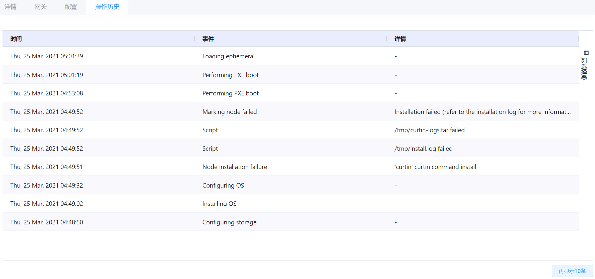

# 4.5.3.裸金属服务器管理

云平台提供裸金属管理服务，可为应用提供专属的物理服务器，保障核心应用的高性能和稳定性。用户可以将裸金属设备部署至云平台，为裸金属服务器配置业务网络、设置裸机分组或进行生命周期的管理。

在“资源管理”菜单下选择左侧“设备管理”的导航菜单，之后点击“裸金属服务器”的子菜单，即可看到裸金属服务器的管理界面：

## 相关操作

HYPERX云管理平台支持管理员对裸金属服务器进行管理，支持的功能如下：

### 服务器组操作

- 添加服务器组：创建一个新的服务器组；
- 编辑服务器组：编辑选定的服务器组；
- 删除服务器组：删除选定的服务器组；

### 服务器操作

- 添加服务器：在平台中添加一台裸金属服务器；
- 编辑服务器信息：编辑裸金属服务器设备信息和接入信息；
- 更新服务器电源状态：更新选定裸金属服务器的电源状态；
- 关闭服务器：关闭选定的裸金属服务器；
- 开启服务器：开启选定的裸金属服务器；
- 安装操作系统：为选定的裸金属服务器安装操作系统；
- 释放服务器：释放选定的裸金属服务器；
- 配置服务器标签：为选定的裸金属服务器设置标签，或移除标签；
- 设置服务器组：将选定的裸金属服务器分配到指定的服务器组中；
- 删除服务器：删除选定的裸金属服务器；

### 网关操作

- 添加网关：在裸金属服务器中添加网关；
- 标记网关断开：将选定的网关标记为断开状态；
- 标记网关连接：将选定的网关标记为连接状态；
- 编辑网关：编辑选定的网关；
- 删除网关：删除选定的网关；

### 子网操作

- 添加Fabric：在平台中添加一个Fabric；
- 添加VLAN：在选定的Fabric中添加一个VLAN；
- 添加Subnet：在选定的VLAN中添加一个Subnet；
- 删除Fabric：删除选定的Fabric；
- 删除VLAN：删除选定的VLAN；
- 删除Subnet：删除选定的Subnet；

### SSH密钥操作

- 创建SSH密钥：在平台导入一个SSH密钥；
- 查看SSH密钥：查看选定的SSH密钥信息；
- 删除SSH密钥：删除选定的SSH密钥；

### 日志操作

- 查看操作历史：查看服务器的操作日志记录。

## 操作说明

### 服务器组操作

#### 添加服务器组

① 在裸金属服务器管理界面中，点击“添加服务器组”按钮：

② 将会弹出“创建服务器组”的操作提示框，可以填写服务器组的名称、备注信息，填写相关信息后，点击“确定”按钮，即可创建服务器组：

> [!NOTE]
>
> - 服务器组的备注信息会显示在服务器名称右侧：
>
> 

#### 编辑服务器组

① 在裸金属服务器管理界面中，选择需要编辑的服务器组，点击服务器组操作列的“编辑服务器组”按钮：

② 将会弹出“编辑服务器组”的操作提示框，修改的名称、说明信息后点击“确定”按钮，更新服务器组相关信息：

#### 删除服务器组

① 在裸金属服务器管理界面中，选择需要删除的服务器组，点击服务器组右侧的“删除”按钮：

②  将会弹出“删除确认”的操作提示框，点击“确定”按钮，删除选定的服务器组：

> [!WARNING]
>
> - 当服务器组中有服务器或服务器组为默认组时，该服务器组不支持删除。

### 服务器操作

#### 添加服务器

① 在裸金属服务器管理界面中，点击“添加服务器”按钮：

② 将会进入添加裸金属服务器的页面，填写服务器相关信息后，点击“保存”按钮，即可添加服务器到云平台：

#### 编辑服务器信息

① 在裸金属服务器管理界面中，选择需要编辑的服务器，点击服务器的名称进入服务器详情页：

② 在服务器详情页中，点击“配置”选项卡，支持对服务器的设备信息和接入信息进行编辑：

③ 编辑相关信息后，点击“保存”按钮，更新服务器的相关信息：

#### 更新服务器电源状态

① 在裸金属服务器管理界面中，选择需要更新电源状态的服务器，点击操作列的“更新电源状态”按钮：

② 将会和服务器同步电源信息，更新裸金属服务器在云平台中的电源状态。

#### 关闭服务器

① 在裸金属服务器管理界面中，选择需要关闭的服务器，点击操作列的“关机”按钮：

② 将会弹出“关机提示”的操作提示框，点击“确定”按钮，即可关闭选定的裸金属服务器：

#### 开启服务器

① 在裸金属服务器管理界面中，选择需要关闭的服务器，点击操作列的“开机”按钮：

② 将会弹出“开机提示”的操作提示框，点击“确定”按钮，即可开启选定的裸金属服务器：

#### 安装操作系统

① 在裸金属服务器管理界面中，选择需要安装操作系统的服务器，点击操作列的“安装操作系统”按钮：

② 将会弹出“安装操作系统”的操作提示框，选择操作系统、版本和核心后，点击“确定”按钮，即可为裸金属服务器安装操作系统：

> [!WARNING]
>
> - 仅Ubuntu操作系统的需要选择核心；
> - 如果是KVM虚拟化的机器不支持安装CENTOS的操作系统。

#### 释放服务器

① 在裸金属服务器管理界面中，选择需要释放的服务器，点击操作列的“释放”按钮：

② 将会弹出“释放”的操作提示框，点击“确定”按钮，即可释放选定的裸金属服务器：

#### 配置服务器标签

① 在裸金属服务器管理界面中，选择需要配置标签的服务器，点击操作列的“标签”按钮：

② 将会弹出“设置标签”的操作提示框，可以为裸金属服务器添加或移除标签，配置服务器标签后，点击“确定”按钮，即可更新服务器的标签信息：

> [!NOTE]
>
> - 若用户需要自定义标签，可以在“标签名称”下拉框中填写自定义标签，将新的标签添加到标签组中。

#### 设置服务器组

① 在裸金属服务器管理界面中，选择需要设置服务器组的服务器，点击操作列的“设置裸机组”按钮：

② 将会弹出“设置服务器组”的操作提示框，选择目标服务器组后，点击“确定“按钮，即可更新裸金属服务器所属的服务器组：

#### 删除服务器

① 在裸金属服务器管理界面中，选择需要删除的服务器，点击操作列的“删除”按钮：

② 将会弹出“删除提示”的操作提示框，点击“确定”按钮，即可删除选定的裸金属服务器：

### 网关操作

#### 添加网关

① 在裸金属服务器管理界面中，选择需要添加网关的服务器，点击服务器的名称进入服务器详情页：

② 在服务器详情页中，选择“网关”选项卡，点击“添加网关”按钮：

③ 将会弹出“创建网关“的操作提示框，填写网关的名称、MAC地址，选择Fabic、VLAN、Subnet等相关信息后，点击“确定”按钮，即可创建网关：

#### 标记网关断开

① 在裸金属服务器管理界面中，选择需要标记网关断开的服务器，点击服务器的名称进入服务器详情页：

② 在服务器详情页中，选择“网关”选项卡，选择需要标记断开的网关，点击操作列的“标记断开”按钮：

③ 将会弹出“标记断开”的操作提示框，点击“确定”按钮，即可将选定的网关标记断开：

#### 标记网关连接

① 在裸金属服务器管理界面中，选择需要标记网关连接的服务器，点击服务器的名称进入服务器详情页：

② 在服务器详情页中，选择“网关”选项卡，选择需要标记连接的网关，点击操作列的“标记连接”按钮：

③ 将会弹出“标记连接”的操作提示框，点击“确定”按钮，即可将选定的网关标记连接：

#### 编辑网关

① 在裸金属服务器管理界面中，选择需要编辑网关的服务器，点击服务器的名称进入服务器详情页：

② 在服务器详情页中，选择“网关”选项卡，选择需要编辑的网关，点击操作列的“编辑”按钮：

③ 将会弹出“编辑网关”的操作提示框，编辑网关的名称、MAC地址、标签名称等信息后，点击“确定”按钮，更新网关相关信息：

#### 删除网关

① 在裸金属服务器管理界面中，选择需要删除网关的服务器，点击服务器的名称进入服务器详情页：

② 在服务器详情页中，选择“网关”选项卡，选择需要删除的网关，点击操作列的“删除”按钮：

③ 将会弹出“删除网关”的操作提示框，点击“确定”按钮，即可删除选定的网关：

### 子网操作

#### 添加Fabric

① 在裸金属服务器管理界面中，选择“子网”选项卡，进入子网的配置界面：

② 在子网的配置界面中，点击“创建网络”按钮，选择“添加Fabric”按钮：

③ 将会弹出“创建Fabric“的操作提示框，填写Fabric的名称后，点击“确定”按钮，即可创建Fabric：

#### 添加VLAN

① 在裸金属服务器管理界面中，选择“子网”选项卡，进入子网的配置界面：

② 在子网的配置界面中，点击“创建网络”按钮，选择“添加VLAN”按钮：

③ 将会弹出“创建VLAN“的操作提示框，填写VLAN的名称、VID信息，并选择VLAN所属的Fabric后，点击“确定”按钮，即可创建Fabric下的VLAN：

#### 添加Subnet

① 在裸金属服务器管理界面中，选择“子网”选项卡，进入子网的配置界面：

② 在子网的配置界面中，点击“创建网络”按钮，选择“添加Subnet”按钮：

③ 将会弹出“创建Subnet“的操作提示框，填写Subnet的名称、CIDR、IP、DNS等信息，并选择Subnet所属的VLAN后，点击“确定”按钮，即可创建VLAN下的Subnet：

#### 删除Fabric

① 在裸金属服务器管理界面中，选择“子网”选项卡，进入子网的配置界面：

② 在子网的配置界面中，选择时需要删除的Fabric，点击名称右侧的“时删除”按钮：

③ 将会弹出“删除确认”的操作提示框，点击“确定”按钮，即可删除选定的Fabric：

> [!WARNING]
>
> - 如果Fabric中有关联的Subnet，则该Fabric不支持被删除。

#### 删除VLAN

① 在裸金属服务器管理界面中，选择“子网”选项卡，进入子网的配置界面：

② 在子网的配置界面中，选择需要删除的VLAN，击名称右侧的“删除”按钮：

③ 将会弹出“删除确认”的操作提示框，点击“确定”按钮，即可删除选定的VLAN：

> [!WARNING]
>
> - 名为untagged的VLAN为Fabric的默认VLAN，不支持删除；
> - 如果待删除VLAN下有Subnet，当VLAN被删除后，该Subnet会被移动到默认VLAN(untagged)下。

#### 删除Subnet

① 在裸金属服务器管理界面中，选择“子网”选项卡，进入子网的配置界面：

② 在子网的配置界面中，选择需要删除的Subnet，击名称右侧的“删除”按钮：

③ 将会弹出“删除确认”的操作提示框，点击“确定”按钮，即可删除选定的Subnet：

### SSH密钥操作

#### 创建SSH密钥

① 在裸金属服务器管理界面中，选择“SSH密钥”选项卡，进入SSH密钥的配置界面：

② 在SSH密钥的配置界面中，点击“创建SSH key”按钮：

③ 将会弹出“创建密钥“的操作提示框，填写密钥的相关信息后，点击“确定”按钮，即可导入SSH密钥至平台：

#### 查看SSH密钥

① 在裸金属服务器管理界面中，选择“SSH密钥”选项卡，进入SSH密钥的配置界面：

② 在SSH密钥的配置界面中，选择想要查看的SSH密钥，点击操作列的“查看”按钮：

③ 将会弹出“查看密钥”的操作提示框，显示SSH密钥的详情信息：

#### 删除SSH密钥

① 在裸金属服务器管理界面中，选择“SSH密钥”选项卡，进入SSH密钥的配置界面：

② 在SSH密钥的配置界面中，选择想要删除的SSH密钥，点击操作列的“删除”按钮：

③ 将会弹出“删除SSH密钥”的操作提示框，点击“确定”按钮，即可删除选定的SSH密钥：

### 日志操作

#### 查看操作历史

① 在裸金属服务器管理界面中，选择需要编辑的服务器，点击服务器的名称进入服务器详情页：

② 在服务器详情页中，选择“操作历史”选项卡，即可看到对裸金属服务器的全部操作日志：

> [!NOTE]
>
> - 默认显示10条日志记录，如需查看更多日志，可以点击“再显示10条”按钮。